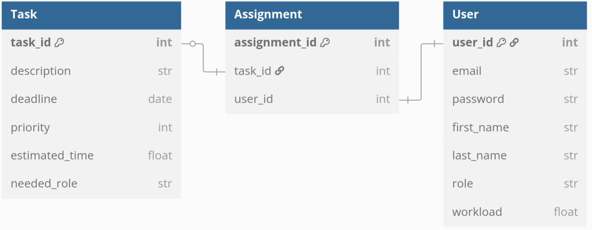

# Small task manager

## Основное

Этот проект сделан в рамках финального проекта по курсу "Программирование на Python" Цифровой кафедры МФТИ. Проект вдохновлён проектом-референсом, исходник можно найти по [ссылке](https://github.com/LXDMIPT/fastapi-taskman).

## Сборка и тесты:

Для сборки проекта достаточно в консоле выполнить команду:

```bash
docker-compose up -d --build
```

После этого можно выполнить тесты:

```bash
docker exec pythonhomework-web-1 pytest --cov=app
```

Аналогично - проверка pylint:

```bash
docker exec pythonhomework-web-1 pylint .
```

## Информация о проекте:

Программа состоит из базы данных на три таблицы, отношения между ними представимы в виде ER модели. Для таблиц реализованы CRUD-запросы, а также логика, позволяющая распределить оптимальным образом оставшиеся задачи (используется жадный алгоритм).

```
Table Task {
    task_id int [primary key]
    description str
    deadline date
    priority int
    estimated_time float
    needed_role str
}

Table Assignment {
    assignment_id int [primary key]
    task_id int
    user_id int
}

Table User {
    user_id int [primary key]
    email str [unique]
    password str
    first_name str
    last_name str
    role str
    workload float
}

Ref tasks: Task.task_id - Assignment.task_id
Ref users: Assignment.user_id - User.user_id
```

 
